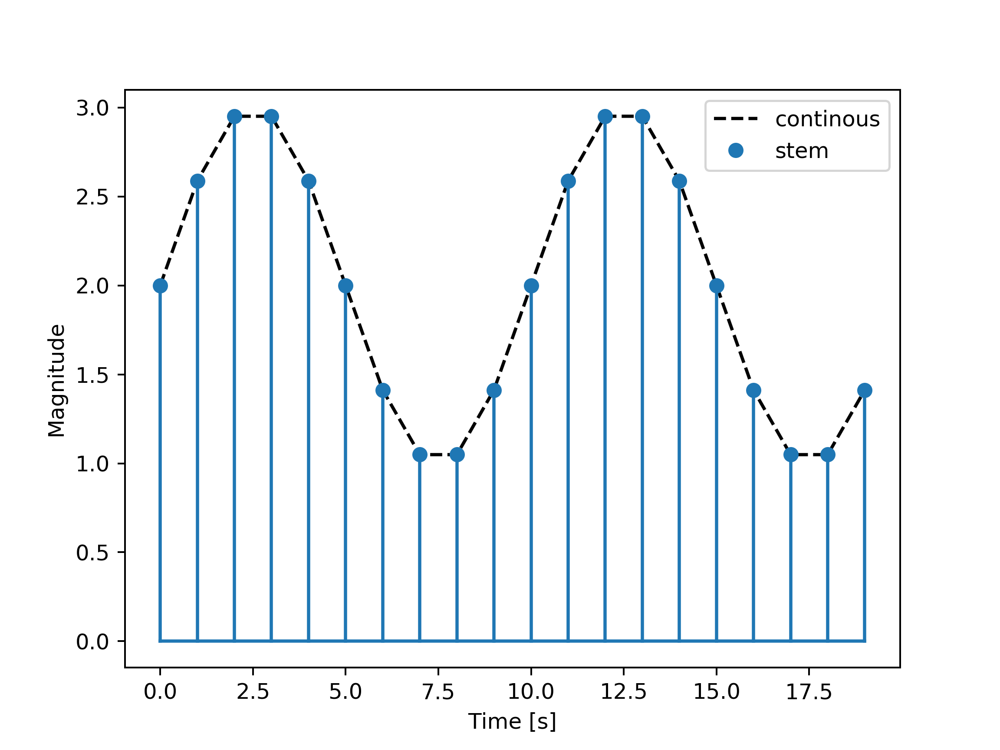

# Plot discrete sequence data

A proper stem plot that mimic matlab's stem function.

`stem(y)` plots the data sequence, `y`, as stems that extend from a baseline along the x-axis. The data values are indicated by circles terminating each stem.

## Example

The figure below shows stem together with regular matplotlib plot.

